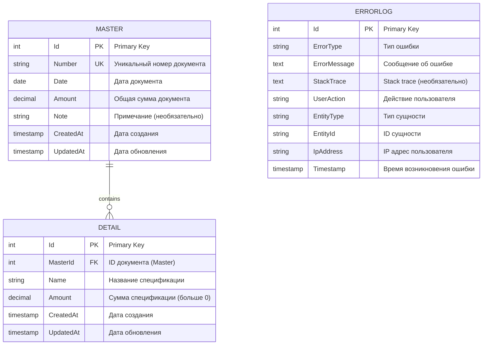

# Master-Detail Application

Полнофункциональное веб-приложение для управления документами и спецификациями с использованием архитектуры Master-Detail.

## 📋 Содержание

- [Стек технологий](#-стек-технологий)
- [Архитектура](#️-архитектура)
- [ERD Диаграмма](#-erd-диаграмма)
- [Зависимости](#-зависимости)
- [Установка и запуск](#-установка-и-запуск)
- [API Endpoints](#-api-endpoints)

## 🚀 Стек технологий

### Frontend
- **Vue.js 3.4.0** - Progressive JavaScript Framework
- **Vue Router 4.2.5** - Официальный роутер для Vue.js
- **Axios 1.6.2** - HTTP клиент для API запросов
- **Vite 5.0.0** - Build tool и dev server
- **Nginx Alpine** - Production web server

### Backend
- **.NET 9.0** - Современная платформа для разработки
- **ASP.NET Core Web API** - RESTful API framework
- **Entity Framework Core 9.0.0** - ORM для работы с БД
- **Npgsql 9.0.0** - PostgreSQL провайдер для EF Core
- **PostgreSQL 16** - Реляционная база данных

### DevOps
- **Docker** - Контейнеризация приложения
- **Docker Compose** - Оркестрация multi-container приложения

## 🏗️ Архитектура

Приложение построено на трехуровневой архитектуре:

```
┌─────────────────────────────────────────────────┐
│              Frontend (Vue.js 3)                │
│         Port: 3000 (Nginx в контейнере)         │
│  - Documents Management (CRUD)                  │
│  - Specifications Management (CRUD)             │
│  - Error Logs Viewer                            │
└─────────────────────────────────────────────────┘
                      ↓ HTTP/REST API
┌─────────────────────────────────────────────────┐
│          Backend (.NET 9 Web API)               │
│             Port: 5000 (внутренний)             │
│  - MasterController (Documents)                 │
│  - DetailController (Specifications)            │
│  - ErrorLogController (Logs)                    │
└─────────────────────────────────────────────────┘
                      ↓ EF Core
┌─────────────────────────────────────────────────┐
│          Database (PostgreSQL 16)               │
│                  Port: 5432                     │
│  - Master (Documents)                           │
│  - Detail (Specifications)                      │
│  - ErrorLogs                                    │
└─────────────────────────────────────────────────┘
```

## 📊 ERD Диаграмма



### Связи:
- **Master → Detail**: One-to-Many (Каскадное удаление)
- **ErrorLog**: Независимая таблица для логирования ошибок

### Ограничения:
- `Master.Number` - уникальный индекс
- `Detail.Amount` - должна быть больше 0
- Каскадное удаление деталей при удалении мастера

## 📦 Зависимости

### Системные требования
- **Docker** >= 20.10
- **Docker Compose** >= 2.0
- **Node.js** >= 18.x (для локальной разработки)
- **.NET SDK** >= 9.0 (для локальной разработки)

### Backend зависимости
```xml
<PackageReference Include="Microsoft.EntityFrameworkCore" Version="9.0.0" />
<PackageReference Include="Npgsql.EntityFrameworkCore.PostgreSQL" Version="9.0.0" />
<PackageReference Include="Microsoft.EntityFrameworkCore.Design" Version="9.0.0" />
```

### Frontend зависимости
```json
{
  "vue": "^3.4.0",
  "vue-router": "^4.2.5",
  "axios": "^1.6.2"
}
```

## 🔧 Установка и запуск

### Docker

1. **Клонируйте репозиторий**
```bash
git clone https://github.com/EbatteSratte/test-task.git
cd test-task
```

2. **Запустите приложение**
```bash
docker compose up --build
```

3. **Откройте в браузере**
```
http://localhost:3000
```

### Остановка приложения

```bash
docker-compose down
```

Для полной очистки (включая volumes):
```bash
docker-compose down -v
```

## 🔌 API Endpoints

### Master (Documents)
```
GET    /api/v1/master?search={query}&sortBy={field}&sortOrder={asc|desc}
GET    /api/v1/master/{id}
POST   /api/v1/master
PUT    /api/v1/master/{id}
DELETE /api/v1/master/{id}
```

### Detail (Specifications)
```
GET    /api/v1/detail
GET    /api/v1/detail/{id}
POST   /api/v1/detail/{masterId}
PUT    /api/v1/detail/{id}
DELETE /api/v1/detail/{id}
```

### ErrorLog
```
GET    /api/v1/error-log?page={n}&pageSize={n}&entityId={id}&fromDate={date}&toDate={date}
DELETE /api/v1/error-log/{id}
```
